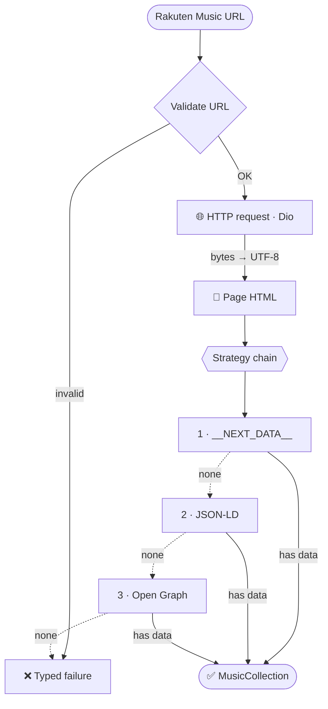

# 🎵 MusConv — How the Parser Works

**Rakuten Music → structured `MusicCollection`**

`URL` ▸ `Validate` ▸ `Fetch` ▸ `Parse` ▸ `Model`

---

## 📌 Overview

The parser takes a Rakuten Music URL, validates it, and fetches the page over
HTTP (read as bytes and decoded as **UTF-8** so Japanese text is correct). It
then extracts the data using **ordered fallbacks** — structured `__NEXT_DATA__`
first, then JSON-LD, then Open Graph — and returns a `MusicCollection`, or a
clear typed error if nothing matches. It always parses the **real page**: no
hardcoded or mock data.

---

## 🔄 Flow

---

## 🧭 Three Steps

### 1️⃣ Validate URL
Checks in order, returning a ready-made error at each stage:

| Check | Failure |
|---|---|
| Non-empty string | `EmptyUrlFailure` |
| Valid `Uri`, `http/https` scheme | `InvalidUrlFailure` |
| Host = `music.rakuten.co.jp` | `UnsupportedDomainFailure` |
| Path `/link/album\|playlist/{id}` | `UnsupportedPathFailure` |

→ yields `RakutenLink { collectionType, sourceId, normalizedUrl }`.

### 2️⃣ Fetch (Dio)
- ⏱️ **Timeouts:** connect 15 s · receive 20 s
- 🧾 **Headers:** `User-Agent`, `Accept`, `Accept-Language: ja`, `Referer`
- 🈶 **UTF-8:** response read as bytes, decoded manually — correct Japanese text
- 🔒 SSL is **never** disabled; failures → `Timeout / NoConnection / PageUnavailable`

### 3️⃣ Parse
The HTML is parsed into a DOM, then run through an **ordered strategy chain**.
The first non-null result wins; if all are empty → `CollectionNotFoundFailure`.

---

## 🎯 Strategies (strongest → weakest)

| # | Strategy | Source in page | Provides |
|:-:|----------|----------------|----------|
| **1** | **NextData** | `<script id="__NEXT_DATA__">` (Next.js SSR) | 🥇 Full data **+ track list** |
| **2** | **JSON-LD** | `script[type="application/ld+json"]` | 🥈 Metadata + tracks (if present) |
| **3** | **Open Graph** | `og:title`, `og:image` | 🥉 Title + cover only |

> 🛡️ If `__NEXT_DATA__` has `status: "ERROR"` (page does not exist), the strategy
> returns "not found" **immediately** — so weaker sources can't produce a
> "false success" from the generic site title.

### 🔗 Field mapping (`__NEXT_DATA__` → model)

| JSON | → `MusicCollection` |
|------|---------------------|
| `name` | `title` |
| `artist.name` | `artistName` |
| `images[0]` (l2 › l1 › s2 › s1) | `imageUrl` |
| `review` | `description` |
| `release_year` | `releaseYear` |
| `song_count` | `trackCount` |
| `songs[]` (`name`, `time`) | `tracks` |

---

## ✨ Key Principles

- 🧩 **Ordered fallbacks** — structured data first, DOM/metadata later
- 🛰️ **Real data only** — no hardcoded or mock content
- 🧯 **Typed failures** — every error has a clear user message
- 🈳 **Safe parsing** — missing fields become `null`, never an exception
- 🧱 **Immutable models** — UI hides empty sections via `has*` getters
- 🔌 **Extensible** — `playlist` and new sites plug in without logic changes

---
